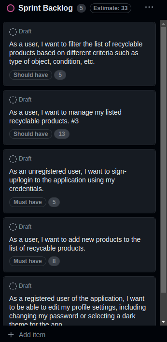
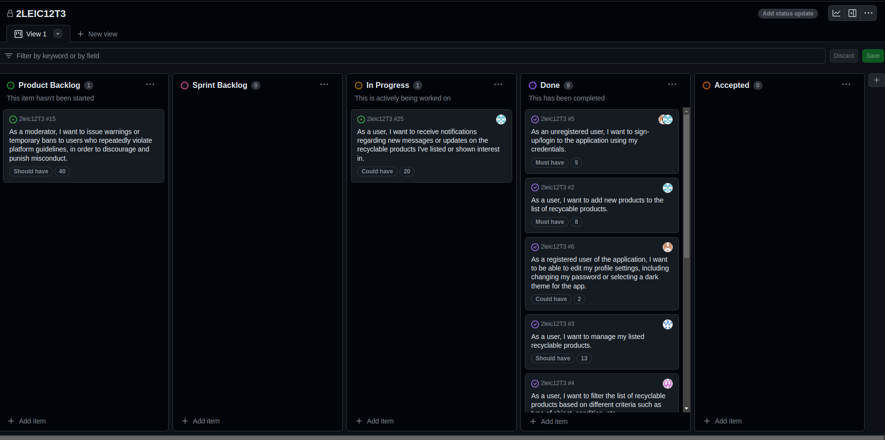

# EcoRevive Project Changelog

## Sprint #1

### Overview
At the conclusion of Sprint #1, we successfully followed the priority defined in the sprint backlog, ensuring that tasks were completed in alignment with their designated importance. By following this prioritization, we effectively tackled essential user stories, such as enabling user registration and login, adding new recyclable products, and providing profile customization options. However, as we transition into Sprint #2, we recognize the need to enhance our development process. To achieve this, we aim to intensify our focus on unit testing throughout the software development lifecycle. By incorporating rigorous testing procedures, we aspire to identify and address potential issues early on, ensuring the delivery of a more robust and reliable product. Additionally, we intend to improve our integration practices by merging divergent features into the product more frequently. This approach will allow us to detect and rectify any bugs or inconsistencies promptly, fostering a smoother and more cohesive development cycle. We are also looking forward to integrating each individual feature into the whole product more often in order to find conflicting bugs.

In this Sprint #1 our backlog tasks rely on some new technologies that we had to implement to deliver a good product.

### These include:
- Implementation of our DataBase the Firestore Database.
- Implementation of our CloudStorage the Firebase Storage, that makes possible the storage of our Product Images and Profile Pictures.Both can be mapped easily.
- Utilizing Device Local Storage to store user preferences, such as the chosen app theme and device login status.
- Enabling access to the device gallery for uploading photos within the app.
- Utilizing e-mail sending technoly to Change Password, in a safe way.

### Sprint Backlog
- [Enabled user registration and login functionality.](https://github.com/FEUP-LEIC-ES-2023-24/2leic12T3/issues/5)
- [Implemented the ability for users to add new recyclable products.](https://github.com/FEUP-LEIC-ES-2023-24/2leic12T3/issues/2)
- [Added profile customization options, including password change and theme selection that is stored in local storage acording to user preferences.](https://github.com/FEUP-LEIC-ES-2023-24/2leic12T3/issues/6)
- [Implemented management functionality for listed recyclable products.](https://github.com/FEUP-LEIC-ES-2023-24/2leic12T3/issues/3)
- [Added filtering options for the list of recyclable products based on various criteria.](https://github.com/FEUP-LEIC-ES-2023-24/2leic12T3/issues/4)

### Sprint#1 Backlog

## Sprint #2

### Overview
At the conclusion of Sprint #2, we continued to build on our initial features and tackled more complex functionalities. We faced some challenges, particularly with implementing integration tests, but we were able to make significant progress in other areas. We aim to refine our integration testing approach moving forward to ensure smoother feature merges and more reliable deployments.

### Features:
- Implementation of Chat system.
- Implementation of our User Community rating.
- Moderator able to ban products that don´t follow guidelines.

### Sprint Backlog
- [Write a feedback comment on other users.](https://github.com/FEUP-LEIC-ES-2023-24/2leic12T3/issues/16)
- [Implemented the ability for users to rate in a scale of 0-5 other users.](https://github.com/FEUP-LEIC-ES-2023-24/2leic12T3/issues/17)
- [Added Chat system.](https://github.com/FEUP-LEIC-ES-2023-24/2leic12T3/issues/18)
- [Moderator banning products that don´t follow guidelines.](https://github.com/FEUP-LEIC-ES-2023-24/2leic12T3/issues/24)

### Sprint#2 Backlog

### Project Board

## Sprint #3

### Overview
At the conclusion of Sprint #3 (final sprint), we successfully implemented all planned features and added some extra functionalities to enhance user experience. Key additions included location services and notification services sent by a server with the admin SDK integrated. The most significant challenge during this sprint was managing time effectively due to overlapping commitments with other projects. Despite this, we maintained our development momentum and delivered a robust final product.
(* in the feature list means that interact with the new Web Server.)
### Features:
- Implementation of Location Services.
- Notification Services.*
- Added Soft/Temporary and Permanent bans.*
- Integration of the new API.
- Moderators are now able to view and manage chats within the app.
- Transactions can now be completed inside the chat page.

### Sprint Backlog
- [Local and External Notification Services.](https://github.com/FEUP-LEIC-ES-2023-24/2leic12T3/issues/25)
- [Moderator banning users, that don´t follow guidelines.](https://github.com/FEUP-LEIC-ES-2023-24/2leic12T3/issues/15)
- [Chat system Location.(improvements)](https://github.com/FEUP-LEIC-ES-2023-24/2leic12T3/issues/18)

### Sprint#3 Backlog

[Link to Project Board](https://github.com/orgs/FEUP-LEIC-ES-2023-24/projects/43/)
