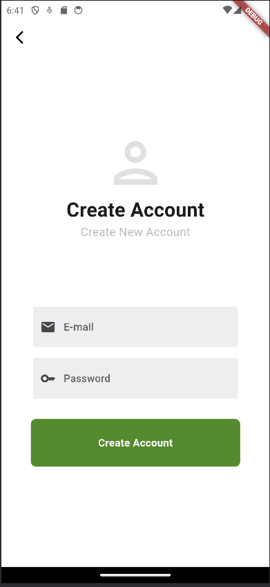
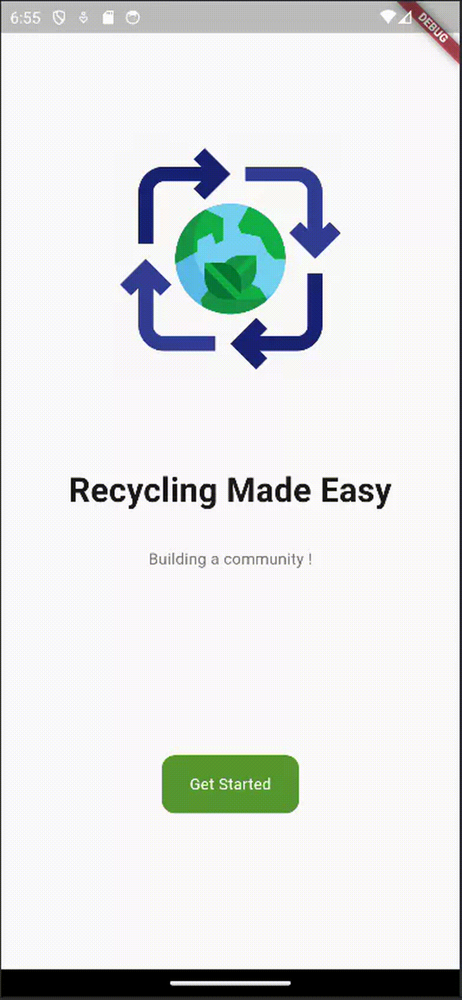

# EcoRevive Development Report

Welcome to the documentation pages of the EcoRevive!

You can find here details about our implementation, from a high-level vision to low-level implementation decisions, a kind of Software Development Report, organized by type of activities: 

* [Business modeling](#Business-Modelling) 
  * [Product Vision](#Product-Vision)
  * [Features and Assumptions](#Features-and-Assumptions)
  * [Elevator Pitch](#Elevator-pitch)
* [Requirements](#Requirements)
  * [Domain model](#Domain-model)
* [Architecture and Design](#Architecture-And-Design)
  * [MVC Architectural Pattern](#mvc-architectural-pattern)
  * [Design Patterns](#design-patterns-consideration)
  * [Logical architecture](#Logical-Architecture)
  * [Physical architecture](#Physical-Architecture)
  * [Vertical prototype](#Vertical-Prototype)
* [Project management](#Project-Management)

## Business Modelling

### Product Vision

- EcoRevive is a community-driven recycling platform that revolutionizes waste management by transforming discarded items into valuable resources, thereby promoting sustainable practices and actively contributing to the establishment of a circular economy.

### Features and Assumptions

#### Main Features

- User registration and login functionality (local storage to keep user logged).
- Ability for users to add new recyclable products.
- Profile customization options, including password change and theme selection (local storage for theme).
- Management functionality for listed recyclable products.
- Filtering options for the list of recyclable products.
- Chat system implementation.
- User Community rating system and feedbacks (where each user has his community rating).
- Moderator ability to ban products that don't follow guidelines.
- Location Services for chat.
- Notification Services (local and external).
- Integration of the Admin SDK.
- Soft bans/temporary bans for user moderation.

#### Assumptions
- Firebase database to store the users credentials aswell as products listing and others...

### Elevator Pitch

- For environmentally conscious individuals tired of the hassle of recycling, the "EcoRevive" app is a sustainable solution. It's a recycling platform that simplifies the process of finding, listing, and discussing recyclable products matching people that want to discard those products, with people looking for them. Unlike other recycling apps that focus solely on listings, our app emphasizes community engagement and social interaction around sustainability. With features like chat functionality and user ratings, EcoRevive fosters meaningful connections between users, making recycling both simple and social.

## Requirements

### Domain model

Each user can list multiple products of various categories on the application.
Whenever a user sees a product that he's interested in, he can start a chat with the owner of said product, where they can message each other.
The application will send notifications to the user whenever a new message is received.
The chat participants can rate each other and leave feedback to improve user experience.
The application has moderatores that unsure guidelines are being respected, being able to ban user that don't respect them.

 

  

## Architecture and Design

### MVC Architectural Pattern:

The Model-View-Controller (MVC) architectural pattern divides an application into three interconnected components, each with distinct responsibilities:

- **Model:** Represents the application's data and business logic. In EcoRevive, the Model component manages data related to users, products, and interactions.

- **View:** Represents the user interface (UI) elements of the application. The View component in EcoRevive encompasses screens for each feature and state of the app.

- **Controller:** Acts as an intermediary between the Model and View components. It handles user input, processes requests, and updates the Model or View accordingly. In EcoRevive, the Controller component manages user interactions and orchestrates the flow of data between the Model and View.

### Design Patterns Consideration:

In the development of the EcoRevive app, we're considering the utilization of various design patterns. Two of the considered patterns are:

- **Strategy Pattern:**
   - The Strategy pattern can be beneficial for implementing different algorithms for product filtering.

- **Factory Method Pattern:**
   - The Factory Method pattern can be employed for adding different types of recyclable items or product objects to the products listing based on user input.

### Logical architecture

The logical architecture of EcoRevive outlines its core components and their interactions. It depicts the user interface (GUI), the logic handling core functionality, and the database for data management within the system (e.g user settings like the app color theme etc). Additionally, it integrates with Firebase for external services such as authentication or data storage. The diagram illustrates how user interactions flow. This logical architecture provides a high-level understanding of how EcoRevive's components work together to fulfill its functionalities.

### Components
#### EcoRevive
- **GUI**: User interface for interacting with the system.
- **Logic**: Core functionality and processing.

#### External Services
- **Firebase Server**: Integrated for features like authentication or data storage.
- **Web Server**: Integrated to enable the use of the Firebase Admin SDK, in order to be able to interact with Firebase Authentication and Firebase Messaging from an admin perspective.

#### Relationships
- User interactions pass from GUI to Logic.
- Logic interacts with the Database for data.
- Logic also communicates with Firebase for external services.

### Physical architecture
The physical architecture section provides an overview of the high-level physical structure of the software system, including physical components, connections, software, and their dependencies. It also discusses the technologies considered for the implementation and justifies the selections made.

#### Technologies Considered:
- **Flutter**: A cross-platform framework for building mobile applications.
- **Firebase**: A Backend-as-a-Service (BaaS) platform providing services like authentication, database, and storage.
- **ExpressJS**: Web framework for Node.js that supports web and mobile applications, APIs, and middleware.
- **Cors**: Cross-Origin Resource Sharing is an HTTP-header based mechanism that allows a server to indicate which origins other than its own are permitted to access its resources.

### Local Storage
- **Local App Storage**: Utilized for storing user preferences, such as the chosen app theme and device login status.
- **Device Gallery Access**: Enabled for uploading photos within the app.

### API integration
The API was built using Express.js and CORS, it provides endpoins to interact with the Firebase Admin Sdk providing powerful functionalities for managing user interactions. Key features include:

- **Sending Notifications:** Effortlessly push notifications to users through Firebase Cloud Messaging (FCM), ensuring timely and effective communication.
- **User Management:** Soft ban and unban users, controlling their access.Or permanent ban an user.
### Vertical prototype
For this initial prototype, we've implemented a basic entry page that serves as the starting point for users accessing the EcoRevive app. Additionally, the entry page offers links to the registration and login pages, enabling users to create accounts or sign in to access EcoRevive's functionalities. These registration and login functionalities are connected to Firebase, ensuring secure user authentication and data management.

#### Entry Page

#### Registration Page

#### Login Page

#### Firebase Interface

To provide a visual representation of the app's navigation flow, we have included several GIFs showcasing different scenarios. 

- **Login**: Demonstrates the successful login process, where a user enters their credentials and accesses the EcoRevive platform.
  
- **Login Failure**: We depict a scenario where the login attempt fails, typically due to incorrect credentials.

- **Register Failure**: This illustrates the process of registering for an account, highlighting a scenario where registration fails, possibly due to existing account conflicts.

- **Transition**: The Transition GIF provides an overview of transition between different pages within the app, showcasing the user experience of navigating through the platform.

Please find below the prototype in motion:

#### Login

#### Login Failure

#### Register Failure

#### Transition

## Project Management

Welcome to our project management system! This system serves as a central hub for organizing and tracking our project's tasks and goals. We use a two-tiered approach, consisting of the Product Backlog and the Sprint Backlog, to effectively manage our project's development.

### Product Backlog
The Product Backlog contains a comprehensive list of all features, tasks, and user stories that need to be addressed throughout the project. Each item is prioritized based on its importance and estimated effort required for completion.

- The following image is our backlog at the start of the project development :

### Sprint Backlog
#### Sprint #0
During sprint planning, we select items from the Product Backlog and move them into the Sprint Backlog, where they are actively worked on by our team throughtout the sprint. 

By utilizing this project management system, we ensure clear communication and efficient task allocation which facilitates the development of EcoRevive.

#### Sprint #1 

- At the conclusion of Sprint #1, we successfully followed the priority defined in the sprint backlog, ensuring that tasks were completed in alignment with their designated importance. By following this prioritization, we effectively tackled essential user stories, such as enabling user registration and login, adding new recyclable products, and providing profile customization options. However, as we transition into Sprint #2, we recognize the need to enhance our development process. To achieve this, we aim to intensify our focus on unit testing throughout the software development lifecycle. By incorporating rigorous testing procedures, we aspire to identify and address potential issues early on, ensuring the delivery of a more robust and reliable product. Additionally, we intend to improve our integration practices by merging divergent features into the product more frequently. This approach will allow us to detect and rectify any bugs or inconsistencies promptly, fostering a smoother and more cohesive development cycle. We are also looking forward to integrate each individual feature into the whole product more often in order to find conflicting bugs.

- The following image is our Sprint#1 backlog at the start of the sprint development:

- The following image is our project board at the end of sprint#1 before the final Sprint review:

#### Sprint #2

- The following image is our Sprint#2 backlog at the start of the sprint development:
  

- The following image is our project board at the end of sprint#1 before the final Sprint review:
  

#### Sprint #2 Retrospective

- Feedback from the team:
  - **What went well:**
    - Successfully implemented the chat system.
    - Implemented the user community rating feature.
    - Moderator functionality to ban products that don't follow guidelines.
  - **What could be improved:**
    - Integration testing could be more robust.
    - More frequent feature merges to detect bugs.
    - Enhance the user experience with more interactive features.
  - **Action items for the next sprint:**
    - Focus on improving integration testing.
    - Implement additional functionalities to enhance the platform.

#### Sprint #3

- The following image is our Sprint#3 backlog at the start of the sprint development (we focused on improving already implemented features and testing)
  
- The following image is our project board at the end of sprint#3 before the final Sprint review:
  
- In this sprint the project board apparently didn´t chance much acrros the sprint, because we focused on improving already implemented features and testing.

#### Sprint #3 Retrospective

- Feedback from the team:
  - **What went well:**
    - Successfully implemented all planned features.
    - Added extra functionalities to enhance user experience.
    - Managed to deliver a robust final product.
  - **What could be improved:**
    - Time management due to overlapping commitments.
    - Enhance testing procedures for future projects.
    - Implement more advanced features to further engage users.
  - **Action items for future sprints/projects:**
    - Focus on improving time management.
    - Enhance testing procedures for future projects.
    - Implement more advanced features to further engage users.

#### Future App Improvements
- Enhanced User Analytics: Implement advanced analytics to better understand user behavior and improve user experience.
- Expanded Community Features: Introduce more community-driven features, such as user groups and event organization tools.
- Mobile App Optimization: Optimize the app for better performance on a wider range of devices and operating systems.
- Gamification: Incorporate gamification elements to increase user engagement and incentivize recycling activities.
- Integration with IoT Devices: Explore integration with IoT devices for real-time tracking of recycling habits and environmental impact.
- Personalized Recommendations: Implement machine learning algorithms to provide personalized product and recycling tips based on user preferences and behaviors.

[Link to Project Board](https://github.com/orgs/FEUP-LEIC-ES-2023-24/projects/43/)
